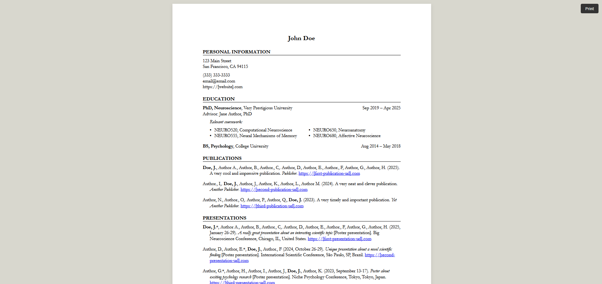
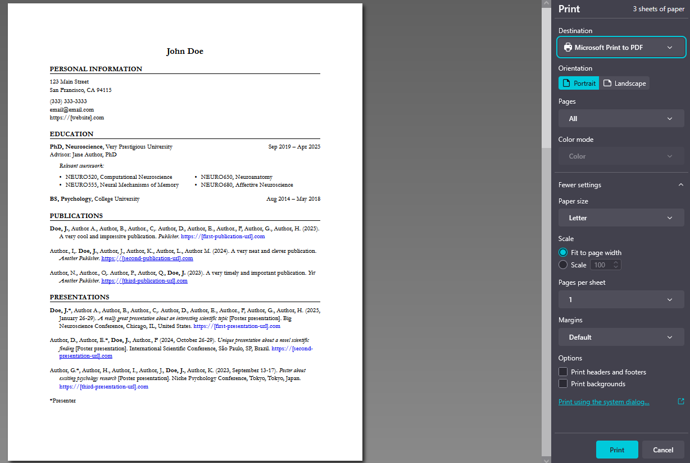

# Boring CV
An Astro template for a bare-bones, printable webpage for an academic CV in json format. Designed to be "boring" on purpose, to resemble a relatively standard academic CV with no unnecessary bells and whistles. Just drop your CV data into the json and get a structured CV for web and print.





# Features
* JSON-driven content (cv.json)
* Pure CSS styling (no frameworks)
* Customizable sections and format
* Auto-formatted links for publications/presentations
* Looks like a piece of paper
* Responsive design for desktop and mobile viewing
* "Print" button :)
* Built using [Astro](https://astro.build/)

# How It Works
* Content is stored in /data/cv.json
* Layout/Rendering is handled by /src/pages/index.astro
* Styling is defined in /styles/cv.css

The Astro page dynamically maps through your JSON data and renders sections conditionally. For example:
* "Courses" under the Education section and "Duties" under the Research Experience section only appear if defined
* Publications and Presentations bold your name
* The “Print” button triggers browser print, but hides itself during printing

# Installation
Clone the repo
```bash
git clone https://github.com/josholiv/boring-cv.git
cd boring-cv
```
Install dependencies
```bash
npm install
```
Run the dev server
```bash
npm run dev
```

# Customization
## Edit /data/cv.json
Update this file with your CV info (your name, education, publications, etc.)

## Change styles
Modify /styles/cv.css to change fonts, layout, colors, etc.

## Add or remove sections
You can add new sections in index.astro by following the existing map patterns. Add sections to cv.json and add them to the const list in index.astro.
